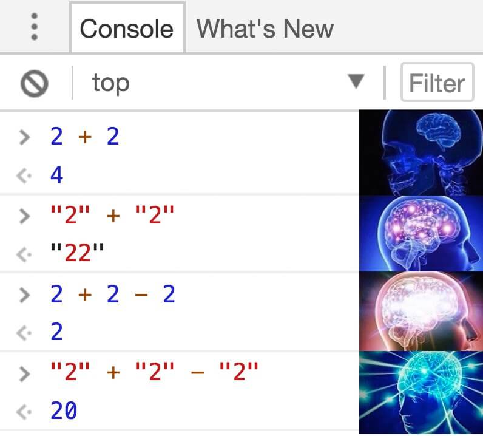

Сегодня рассмотрим каверзные( и не очень) вопросы в JavaScript и попробуем в них разобраться. Некоторые из этих вопросов мне попадались на собеседованиях, некоторые я выбрал сам. Тема каждого вопроса достойна отдельного поста и не ограничивается парочкой примеров. Здесь лишь краткое пояснение общих моментов. 

## Strict Mode
___
Каким будет результат работы данного скрипта?
```javascript
'use strict'
function f() {
  console.log(this);
}
f();
```

Так как код в **strict mode** - ответ будет **undefined**.

Это что-то вроде подстраховки. До введения es6 классов, для реализации паттерна конструктор использовались функции( сейчас тоже используются, классы под капотом те же функции) и если разработчик случайно забудет написать **new** при создании экземпляра класса, то **this** будет ссылаться на глобальный объект window.  

```javascript
function Person(model){
    console.log(this)
  }

let Jack  = new Person() // Person {}
let John = Person(); // Window {}
```
<br />


## Hoisting
___
Каким будет результат работы данного скрипта?
```javascript
console.log(x);
var x = 4;
console.log(x);
```

Ответ будет **undefined** и **4**. 

Разгадка кроется в понимании того как работает хойстинг и область видимости в JavaScript. К переменным, объявленным через **var**, можно обратиться прежде чем они будут объявлены.
Ничего подобного не будет в **strict mode** или при использование **let**, мы получим ошибку **ReferenceError: Cannot access 'x' before initialization**


## Преобразование типов
___


 Чему равна переменная foo?
```javascript
var foo = 10 + "20";
```
Ответ строка **"1020"**.

Это, пожалуй, одна из самых забавных особенностей JavaScript. Всё дело в преобразовании типов.
В данном примере - при сложении числа и строки происходит **строковое преобразование** и конкатенация. Почти все остальные математические операторы выполняют **численное преобразование**:
```js
var foo = 10 - "20" // 10
```
<br/>

## Call и Apply
___
Для чего нужны методы call и apply?

Call и Apply позволяют нам вызывать функцию с нужным контекстом.
Эти методы всегда первым параметром принимают контекст( **this** ),  затем  параметры функции. В отличии от Call,  Apply принимает в качестве аргумента массив.
```javascript

let obj = {
  x:2
}

function add(a){
    console.log(this.x + a)
}

function addMore(a,b){
    console.log(this.x + a + b)
}

add.call(obj, 3) // 5
addMore.apply(obj, [3, 2]) // 7

```
<br/>

## typeof
___
Какой тип вернет оператор **typeof** для функции?
```javascript

var f = function() {}
console.log(typeof f)

```
Ответ: **function**

В JavaScript 8 типов данных:
* **Number**
* **BigInt**
* **String**
* **Boolean**
* **null**
* **undefined**
* **Symbol**
* **Object**

Так откуда же взялась function?
Функции как и массивы являются специальным типом Object. 
Хоть typeof возвращает function на самом деле это объект. 
___

Зачастую полезно не спешить с ответом чтобы не наткнуться на подводные камни. Примеры с преобразованием типов и областью видимости могут быть особенно запутанными. На этом всё.  