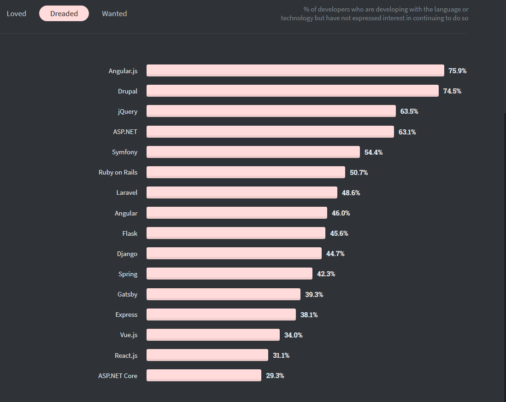
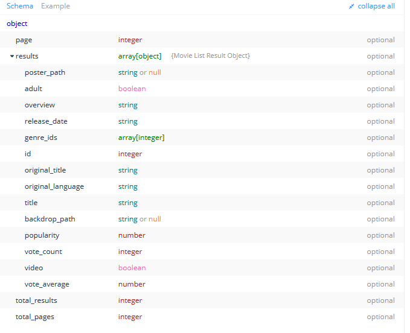

Когда я только знакомился с JavaScript фреймворками, мой выбор пал на Angular. Банально за то, что его курирует Google. Я набросал небольшое [приложение для голосования](https://meanvoting-app.herokuapp.com/#/). Вышло нечто с навбаром от бустрапа в перемешку с компонентами из Material design, где я писал на TypeScript как на JavaScript, не понимая толком зачем это нужно. Всё это было запушено на гитхаб вместе с node_modules. Сейчас, оглядываясь назад, я понимаю что это лучший из худших моих пет проектов. В итоге Angular мне показался сложным и толком не оценив сей фрейморк, я ушел в React.

Узнав недавно по итогам StackOverflow 2020, что Angular признан самым неприятным( ужасающим ) веб фреймворком, я решил еще раз встретиться со старым другом.



Это статья о том, как вооружившись документацией и гуглом, я набросал простое приложение со списком популярных фильмов и поиском кино с использованием tmdb API https://developers.themoviedb.org/3/getting-started/introduction.

Результат -  https://tenzeniga.github.io/angular-movies/

Код - https://github.com/TenzenIga/angular-movies/tree/master/src


## Главная страница
Начать с Ангуляр довольно просто. Достаточно установить Angular Cli.

Для создания нового проекта вводим команду **ng create**
```Javascript
 ng create movies
 ```
Будет предложено выбрать препроцессор для стилей. Я выбрал Sccs и выбрал включить роутинг.


Пока в проекте 1 главный компонент(помимо множества конфигурационных файлов) **app.component.ts**, в нем через декоратор **@component** подключен файл со стилями и разметкой **app.component.html** и **app.component.scss**.

Чтобы создать новый компонент нужно ввести команду **ng generate component** 
сокращенно **ng g c**
На лавной странице у нас будет крутой постер из Криминального чтива и поисковиком по центру. Создадим этот компонент:

>**Все стили, картинки и шрифты можно найти в [репозитории](https://github.com/TenzenIga/angular-movies/tree/master/src)**

```js
ng g c components/search
```
Компонент Search будет в директории components
Если открыть app.modules.ts ,там уже будет импортирован созданный компонент SerachCompoenent. Там же нужно импортировать **HttpClientModule** и добавить массив **imports**.

Мы хотим отобразить инпут для поиска фильмов. При вводе данных должен появляться div с 5 подсказками.
Чтобы получить список подсказок, нужно сделать API запрос [search/movie](https://developers.themoviedb.org/3/search/search-movies). Это можно сделать в **search.components.ts** , но лучше вынести метод в одельный сервис и внедрить его в компонент. 
Создадим сервис для api запросов
```js
ng g s services/api
```

**api.service.ts**
```ts
import { Injectable } from '@angular/core';
import { HttpClient, HttpErrorResponse } from '@angular/common/http';
import {throwError as observableThrowError, Observable } from 'rxjs';
import { catchError } from 'rxjs/operators';
import { ResponseMovies } from '../interfaces/interfaces';


@Injectable({
  providedIn: 'root'
})
export class ApiService {
  API_KEY = '****';

 
  constructor(
    private http: HttpClient
  ) { }

  searchMovies(e:string):Observable<ResponseMovies>{
    return this.http.get<ResponseMovies>(`https://api.themoviedb.org/3/search/movie?api_key=${this.API_KEY}&language=en-US&query=${e}&page=1&include_adult=false`)
    .pipe(catchError(this.errorHandler));
  }

  errorHandler(error:HttpErrorResponse){
    return observableThrowError(error.message || "Server error");
  }
}
```


Чтобы сделать http запрос нужно импортировать HttpClient.
В классе **Apiservice** создаем поле **API_KEY** с API ключом.
Внутри метода конструктор инициализируем **httpClient**.
Создаем метод ***searchMovies***, который принимает строку и возвращает **Observable**.
Для обрабоки ошибок используем методы библиотеки **Rxjs**

Так как мы используем TypeScript - нужно указать типы данных, которые мы получим с сервера. В документации tmdb API можно увидеть полную схему ответа. 



Нам нужны только название фильма, id и ссылка на постер.
В отдельном файле создадим и экспотируем интерфейсы **ResponseMovie** и **Movie**. 

**interface.ts**
```ts
export interface ResponseMovies{
    results:Movie[]
  }
  
export interface Movie{
    id: number
    original_title: string
    poster_path: string 
  }
```
 
Сервис готов теперь его можно заиджектить в **search.component.ts**.
Создадим разметку страницы. Нам нужен input и div который будет отображать подсказки 

**search.component.html**
```html
<div class="bg-image">
    <div class="search-wrapper">
      <h2>Your favorite movies.</h2>
      <input type="text" #search placeholder="Search movies">
      <div class="suggestions">
        <p *ngFor="let suggestion of suggestions | slice:0:5">
            {{suggestion.original_title}} 
        </p>
      </div>
    </div>
  </div>
```

Тут используются некоторые фундаментальные концепии Angular. 
 Структурная деректива **ngFor** позволяет перебрать массив ***suggestions***. С помощью оператора pipe **|**, можно всячески форматировать отобржаемые данные, в данном случае, мы сокращаем массив до первых 5 элементов.
  
В input мы добавили шаблоную переменную #search, через неё мы будем отлавливать измения в поле ввода.

**search.component.ts**
```ts
import { Component,  AfterViewInit, ViewChild, ElementRef } from '@angular/core';
import { ApiService } from 'src/app/services/api.service';
import { fromEvent } from 'rxjs';
import { map, debounceTime, distinctUntilChanged, tap, filter } from 'rxjs/operators';
import { Movie } from 'src/app/interfaces/interfaces';

@Component({
  selector: 'app-search',
  templateUrl: './search.component.html',
  styleUrls: ['./search.component.scss']
})
export class SearchComponent implements AfterViewInit{
  
  @ViewChild('search') searchInput: ElementRef;

  suggestions:Movie[] = [];

  constructor(
    private apiService:ApiService
  ){}

  ngAfterViewInit() {
    
    // Api call search
    fromEvent(this.searchInput.nativeElement,'keyup')
      .pipe(
          map((event:any)=>{
            return event.target.value;
          }),
          filter(
            res =>{ 
              if(res.length > 2){
                return true;
              }else{
                this.suggestions = [];
                return false
              }
            }
          ),
          debounceTime(500),
          distinctUntilChanged(),
          tap(() => {
              
            this.handleSearch(this.searchInput.nativeElement.value)
          })
      ).subscribe()
}

    handleSearch(searchInput:string){
  
        this.apiService.searchMovies(searchInput).subscribe(data =>{
              this.suggestions = data.results;
            
        });

    }
}
```

В декоратор  **@ViewChild** передаем имя переменной, поле searchInput теперь указывает на переменную search.
Создаем пустой массив ***suggestion***.
В constructor иницируем **ApiService**.

**ngAfterViewInit** - метод жизненного цикла, который запускается после рендера компонента, так **@ViewChild** имеет доступ к значению в input.

Функция ***handleSearch*** запускает метод apiService и обновляет массив подсказок

Чтобы уменьшить количество запросов на сервер, хорошей практикой считается добавить искусственную задержку перед отправлением запроса, другими слвовами debounce. Для этого можно воспользоваться библиотекой **rxjs**:

**filter** - фукнция поиска не будет запускаться, пока инпут меньше 2 символов. 
**debounceTime** - время задержки.
**distinctUntilChanged** - отличается ли новое значение от предыдущего.

Чтобы отобразить созданный компонент.

**app.component.html**
```html
<app-search></app-search>
<router-outlet></router-outlet>
```


## Список фильмов
Создадим компонент для списка самых популярных фильмов и добавим метод ***getMovies*** в **api.service.ts**
```
ng g c components/movies-list
```

**api.service.ts**
```ts
  ...

  getMovies():Observable<ResponseMovies>{
    return this.http.get<ResponseMovies>(`https://api.themoviedb.org/3/movie/popular?api_key=${this.API_KEY}&language=en-US&page=1`)
    .pipe(catchError(this.errorHandler));
  }
}
```
<br/>

**movies-list.component.html**
```html
<section class="movies-section">
    <div class="container">
      <div class="subheading">Popular movies</div>
        <div class='movie-list'>
          <div *ngFor="let movie of movies | slice:0:10" class="movie-list__item">
            
          </div>
        </div>
    </div>
  </section>
```
Тут уже знакомая директива ***ngFor** и пайп slice. Для приведение значения переменной с сылкой на постер фильма, src оборачивается в квадратные скобки **[src]**.
<br/>

**movies-list.component.ts**
```ts
import { Component, OnInit } from '@angular/core';
import { Movie } from 'src/app/interfaces/interfaces';
import { ApiService } from 'src/app/services/api.service';

@Component({
  selector: 'app-movies-list',
  templateUrl: './movies-list.component.html',
  styleUrls: ['./movies-list.component.scss']
})
export class MoviesListComponent implements OnInit {
  movies:Movie[] = [];
  constructor(
    private apiService:ApiService,
  ) { }

  ngOnInit(): void {
    this.getMovies();
  }

  getMovies():void {
    this.apiService.getMovies().subscribe(data =>{
      this.movies = data.results;
    });
  }
  
}
```

**ngOnit** - метод жизненного цикла, который вызывается после инициализации компонента. 

Аналогичным способом создается компонент со списком самых рейтинговых фильмов, разница лишь в методе API и количестве отображаемых элементов.

## Routing
При клике на фильм из поиска или списка, нам нужно открыть отдельную страницу с описанием сюжета, трейлером и постером.Также не помешает страница для отображения ошибки 404 на случай, если страница не найдена. Для этого нужен роутинг.

Создадим компонеты страницы фильма и страницы 404

```
ng g c components/movie-page
ng g c components/page-not-found
```
И обертку для компонентов главной страницы **Main** и футер который будет отображаться на каждой странице.

```
ng g c components/main
ng g c components/footer
```
Стили и html футера в репозитории.

**main.component.html**
```html
<app-search></app-search>
<app-movies-list></app-movies-list>
<app-top-movies></app-top-movies>
```

Чтобы добавить роут, в **app.routing.module**, нужно указать адрес и компонент.
Адрес компонента PageNotFound указывается последним в списке.

**app.routing.module**
```ts
...
const routes: Routes = [
  {path:'', component:MainComponent},
  {path: 'movie/:id', component: MoviePageComponent},
  {path:'**', component: PageNotFoundComponent}
];
...
```

В app.component.html
```html
<router-outlet></router-outlet>
<app-footer></app-footer>
```
Т.к футер не входит в **main.component.html**, он будет отображаться на каждой странице.


Осталось сделать так чтобы при нажатии на фильм или название фильма открывалась страница фильма. Для этого в **search.component.html** нужно добавать click ивент.   

**search.component.html**
```html
...
<p (click)="onSelect(suggestion)" *ngFor="let suggestion of suggestions | slice:0:5">
            {{suggestion.original_title}} 
</p>
...
```

В search.component.ts нужно импортировать Router и заинджектить в constructor.
Функция **onSelect**, через метод **router.navigate** перенаправляет на страницу /movie/{id}
(То же самое проделывается в компоненте со списком фильмов)


**search.component.ts**
```ts
...
import { Router } from '@angular/router';

...
  constructor(
    private router:Router,
    private apiService:ApiService
  ){}

  onSelect(suggestion:Movie){
      this.router.navigate(['/movie', suggestion.id]);
    }
```

## Страница фильма
Чтобы получить информацию о фильме нужно воспользоваться методом **tmdb API [/movie/{movie_id}](https://developers.themoviedb.org/3/movies/get-movie-details)**

Для того чтобы получить трейлер фильма -
**[/movie/{movie_id}/videos](https://developers.themoviedb.org/3/movies/get-movie-videos)**

Оба метода возвращают объект с большим количеством полей и информации. Создадим интерфейс, где выделим нужные нам параметры.

**interface.ts**
```ts
...
export interface ResponseVideo{
  results:Video[]
}

  export interface MovieDetail{
    backdrop_path:string | null
    budget:number
    genres:Genre[]
    overview:string | null
    popularity: number
    release_date:string
    poster_path:string | null
    title:string
    tagline:string | null
  }

interface Genre{
  id:number
  name:string
}

export interface Video{
  key:string
}
```

Добавим новые методы в сервис

**api.service.ts**
```ts
...
  getMovieDetail(id:number):Observable<MovieDetail>{
    return this.http.get<MovieDetail>(` https://api.themoviedb.org/3/movie/${id}?api_key=${this.API_KEY}&language=en-US`)
    .pipe(catchError(this.errorHandler));
  }
  
  getMovieTrailer(id:number):Observable<ResponseVideo>{
    return this.http.get<ResponseVideo>(`https://api.themoviedb.org/3/movie/${id}/videos?api_key=${this.API_KEY}&language=en-US`)
    .pipe(catchError(this.errorHandler));
  }
```
Осталось набросать html структура компонента MoviePage

**movie-page.component.html**
```html
<div class="movie" >
    <div *ngIf="isLoading">
        <h3>Loading...</h3>
    </div>
     <ng-container *ngIf="movie">
        <div class="movie__detail movie-detail">
            <button class="btn-back" (click)="goHome()">&#8592; Back</button>
            <h2>{{movie.title}} ({{movie.release_date}})</h2>
                <span class="movie__genre" *ngFor='let genre of movie.genres'>
                    {{genre.name}}
                </span>
            <h3>Overview</h3>
            <p>{{movie.overview}}</p>
    
           <iframe *ngIf='video'  [src]="videoUrl" frameborder="0"></iframe>
        </div>
        
     </ng-container>
</div>
```
Деректива ***ngIf**, как можно догадаться из названия, позволяет отображать тот или иной элемент DOM в зависимости от условий. В данном случае мы показываем альтернативный шаблон #loading, пока данные не будут получены с сервера.

**movie-page.component.ts**
```ts
export class MoviePageComponent implements OnInit {
  videoUrl;
  video:Video[];
  movie:MovieDetail;
  isLoading: boolean;
  constructor(
    private route:ActivatedRoute,
    private router:Router,
    private apiService:ApiService,
    private _sanitizer: DomSanitizer
  ) { }
  

  //get movie info on page init
  ngOnInit(): void {
    let id = parseInt(this.route.snapshot.paramMap.get('id'));
    this.isLoading = true;
    this.apiService.getMovieDetail(id).subscribe(result => {
      this.movie = result    
    });
    
    this.apiService.getMovieTrailer(id).subscribe(data =>{
      this.isLoading = false;
      this.video = data.results;
      this.videoUrl = this._sanitizer.bypassSecurityTrustResourceUrl( `https://www.youtube.com/embed/${this.video[0].key}`);
    }, (err)=>{
      this.isLoading = false;
    })
  }

  goHome(){
    this.router.navigate(['']);
  }
}
```
С помощью **ActivatedRoute** мы можем достать id фильма *this.route.snapshot.paramMap.get('id')*
<br/>
Так как ссылка на видео в iframe сохранена в качестве переменной, чтобы избежать ошибки **Error: unsafe value used in a resource URL context**, нужно использовать **DomSanitazer**.<br/>
Фукнция *goHome()* - позволяет вернутсья обратно на главную страницу.

Про компонент страницы page-not-found расписывать не буду, т.к там ничего не происходит. Можно убедиться, что она работает, если ввести ложный адрес.

## Итог
Ангуляр очень мощный инструмент и моя поверхостная пробежка по базовым моментам не раскрывает и половины возможностей этого фреймворка. В сравнении с реактом, ощущается громоздким и перенасыщенным магией.      