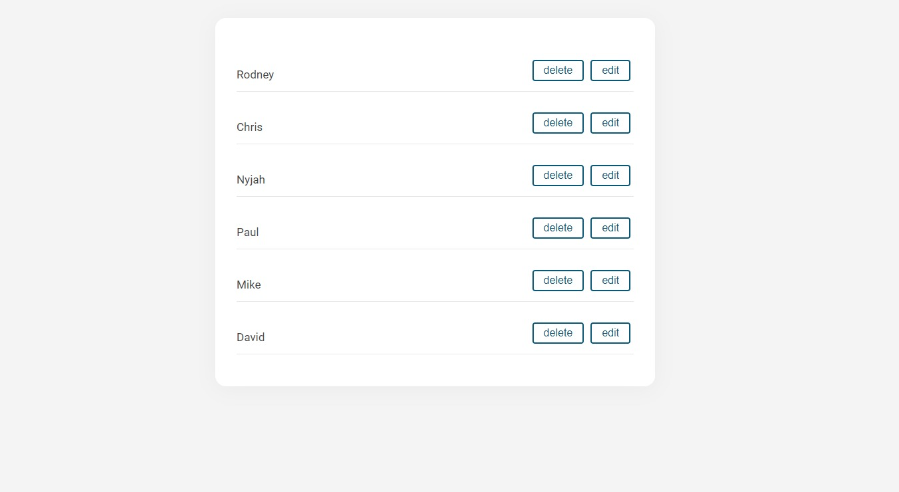
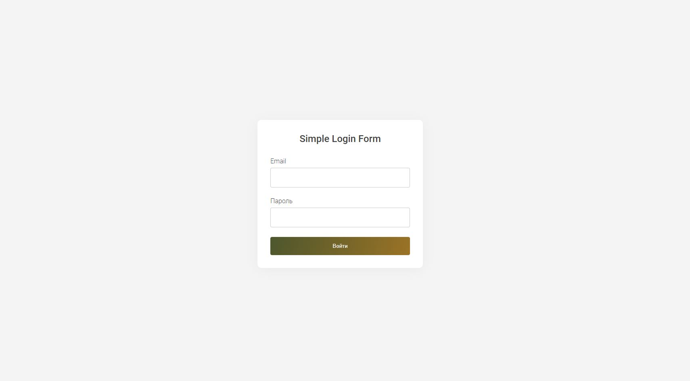

Сегодня будем разбирать библиотеку для стейт менеджемента Mobx на примере реального тестого задания.
 
Суть задачи - сделать небольшое приложение на React с авторизацией и страницей списка контактов.
По желанию можно добавить поиск по списку контактов.

Обязательные пункты:

- страницу контактов можно увидеть после авторизации
- контакты можно добавлять, редактировать и удалять.
- использовать typescript
- использовать стейт менеджер на выбор(Redux / Mobx)

В качестве бд можно использовать [json-server](https://github.com/typicode/json-server)

К слову, для такого простого проекта стейт менеджер - это оверкил, достаточно contex api, но мы будем использовать mobx.

## Mobx vs Redux

У каждого из подходов есть плюсы и минусы, к достоинствам Mobx можно отнести - меньше бойлерплейта и простота изучения, а Redux - иммутабельноость, чистые функции и [time traveling](https://medium.com/asayer/time-travel-debugging-with-redux-and-profiler-25f274caf2a4).

## Старт

Начинаем с установки зависимостей для mobx и react router.

```
npm i mobx mobx-react-lite react-router-dom 
```

Нам понадобится сама библиотека mobx и т.к мы будем использовать только функциональные компоненты нам достаточно mobx-react-lite.
Для имитации бд, я использую json-server **db.json**

**json.db**

```json
{
    "contacts": [
        {
            "id": 1,
            "name": "Rodney"
        },
        {
            "id": 2,
            "name": "Chris"
        },
        {
            "id": 3,
            "name": "Nyjah"
        },
        {
            "id": 4,
            "name": "Paul"
        },
        {
            "id": 5,
            "name": "Mike"
        },
        {
            "id": 6,
            "name": "David"
        }
    ]
}
```

Запуск json server на порте 4000

```
json-server -p 4000 db.json
```


## Основы Mobx

Mobx базируется на 3 концепциях: 
 1) **observable** - реактивное состояние стора 
 2) **action** - операция для изменения состояния 
 3) **computed** - read only значения вычисляемые из observables и автоматически обновляющиеся при их изменениях

Начать с mobx очень просто, создим наш стор класс **Store**:

- массив контактов *contacts*
- boolean *isAuth* статус авторизации
- методы для загрузки, добавления, удаления, редактирования пользователей и авторизации

```js
export interface IContact {
    id: number
    name: string
}

const URL = "http://localhost:4000";


class Store {
    public isAuth: boolean = false;

    public contacts: IContact[] = [];

    constructor(){
        makeAutoObservable(this);
    }
    
    public login(): void{
        this.isAuth = true;
    } 

    public logout(): void {
        this.isAuth = false;
    }
    public getContacts(): void {
        fetch(`${URL}/contacts`).then(response => response.json())
        .then((res: IContact[]) =>{
            runInAction(()=> this.contacts = res)
        });
        
    }

    public addContact( contact: IContact): void{
        this.contacts.push(contact)
    }

    public editContact(newName: string, id: number  ){
        this.contacts = this.contacts.map(item => {
            if(item.id === id){
                item.name = newName;
            }
            return item;
        })
    }

    public deleteContact(id:number): void {
        this.contacts = this.contacts.filter(c => c.id !== id);
    }

    public filterData(value: string): void {
        this.contacts =  this.contacts.filter( contact => contact.name.toLowerCase().indexOf(value.toLowerCase()) > -1);
    }

}

const store = new Store();

export default store;
```

С помощью **makeAutoObservable()** мы преобразуем наши поля в observable, а методы в **actions**. Через action и только через него мы меняем состояние. Также стоит упомянуть про **computed** методы. Они обозначаются через гетторы и служат для расчетов и кеширования, их у нас не будет.

Так как загрузка списка пользователей асинхронная операция, то в метод *getContacts* мы добавляем **runInAction** - это не обязательно, но считается хорошей практикой. Другой вариант осуществления http запросов - использование генераторов.

При использовании **makeAutoObservable()** observables, actions и computed устанавливаются автоматически, но можно всё прописать самому, пример выше с использованием **makeObservable()**:

```js
    public isAuth: boolean = true;

    public contacts: IContact[] = []

    constructor(){
        makeObservable(this, {
            isAuth: observable,
            contacts: observable,
            getContacts:action,
            login: action,
            logout: action,
            addContact: action,
            editContact: action,
            deleteContact: action,
            filterData: action
        });
    }
    ...
```

Собственно, в этом и весь mobx. Наш стор - это observables, которые мы отслеживаем, есть actions через которые мы меняем состояние и есть computed для вычислений и оптимизации производительности.

И чтобы вся эта магия заработала нужно всего лишь обернуть компонент в **observer**.

**MainPage.tsx**

```tsx
function MainPage() {
    useEffect(()=>{
        store.getContacts()
    },[])

    const contacts = store.contacts;   
  return (
      <div className="main-page">
          <div className='content'>
                  <div className='contact-list'>
                    {contacts.map( (contact: IContact) =>{
                        return <Contact key={ contact.id} contact = {contact} />
                    })}
                  </div>
          </div>
      </div>
  )
}

const MainPageObserver = observer(MainPage)

export default MainPageObserver;
```

На главной странице через useEffect подгружаем контакты и через пропсы прокидываем в компонент **Contact**( весь код со стилями можно глянуть в [репозитории](https://github.com/TenzenIga/take-off)). Обернув **MainPage** в **observer**, мы можем использовать данные из стора.




Точно так же с авторизацией. Чтобы ограничить доступ к главной странице создадим компонент ProtectedRoute. Через него, в зависимости от статуса isAuth, либо перенаправляемся на страницу логина, либо в получаем компонент который пробросили через **props.children**.

**ProtectedRoute.tsx**

```ts
const ProtectedRoute = ({ children }: { children: JSX.Element }) => {
    
    let location = useLocation();
  
    if (!store.isAuth) {
  
      return <Navigate to="/login" state={{ from: location }} replace />;
    }
  
    return children;
  }
const ProtectedRouteObserver = observer(ProtectedRoute);

export default ProtectedRouteObserver;
```

С помощью observer отслеживаем изменения переменной **isAuth**. Страница авторизации носит чисто формальный характер, в реальном приложении не обойтись без валидации и токенов, здесь мы просто логинимся введя любой логин и пароль.

**Login.tsx**

```tsx
function Login() {
    const [email, setEmail] = useState('');
    const [password, setPassword] = useState('');
    let navigate = useNavigate();

    const login = (): void =>{
        if(email && password){
            store.login();
            navigate('/', {replace: true})
        }
    }
    
    return (
        <div className="login">
            <div className="bg-image"></div>
            <div className="form-wrapper">
                <div className="heading">
                Simple Login Form
                </div>
                <form >
                    <div className="form-group">
                        <label>
                            Email
                        </label>
                        <input className="form-control" value={email}  type='email' onChange={e => setEmail(e.target.value)}  required />
                    </div>
                    <div className="form-group">
                        <label>
                            Пароль
                        </label>
                        <input type="password" value={password} onChange={e => setPassword(e.target.value)} className="form-control" required/>
                    </div>
                        <input type="submit" value="Войти" onClick={()=>login()} className="btn"  />
                </form>
            </div>
      </div>
    )
}

const LoginObserver = observer(Login)
export default LoginObserver;
```

Осталось прописать роуты в App.tsx

**App.tsx**
```tsx

function App() {
  return (
    <Routes>
      <Route path='/' element={
        <ProtectedRouteObserver>
          <MainPageObserver />
        </ProtectedRouteObserver>
      } />
      <Route path="/login" element={<LoginObserver />} />
  </Routes>
  );
}

export default App;
```
<br>
<br>



По такому же принципу внедряется поиск с фильтром и удаление/редактирование/добавление контактов. Создаем компонент, оборачиваем в observer и достаем стор с нужными значениями и методами.

---
Таким образом, Mobx делает всё то же самое что редакс, но при этом меньше кода и не нужно разбираться во всяких редюсерах и сагах. Конечно, это далеко не весь арсенах Mobx, там есть свои продвинутые штуки и подводные камни, но это уже совсем другая история.